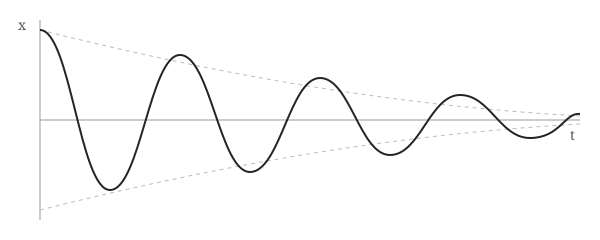

This post shows every feature available when writing. Open
`src/content/posts/writing-guide/index.md` next to this page to see the markdown behind each example.

## Frontmatter

Every file starts with a block of settings between `---` lines:

```yaml
---
title: Writing Posts with Equations, Code and Figures
date: 2026-09-26
summary: Optional line shown under the title.
toc: true # optional: show a table of contents
draft: true # optional: hide from the built site
---
```

## Equations

Math equations uses LaTeX syntax and is rendered by [KaTeX](https://katex.org/) when the site is built, so readers get plain HTML with no JavaScript.

### Inline equations

Wrap inline equations in single dollar signs: the energy of a photon is $E = h\nu$, and the
Gaussian integral is $\int_{-\infty}^{\infty} e^{-x^2}\,dx = \sqrt{\pi}$.

### Display equations

Put display equations on its own lines between double dollar signs:

$$
i\hbar \frac{\partial}{\partial t} \Psi(\mathbf{r}, t) = \left[ -\frac{\hbar^2}{2m} \nabla^2 + V(\mathbf{r}, t) \right] \Psi(\mathbf{r}, t)
$$

Multi-line derivations work with `aligned`:

$$
\begin{aligned}
\nabla \cdot \mathbf{E} &= \frac{\rho}{\varepsilon_0} & \nabla \cdot \mathbf{B} &= 0 \\
\nabla \times \mathbf{E} &= -\frac{\partial \mathbf{B}}{\partial t} & \nabla \times \mathbf{B} &= \mu_0 \mathbf{J} + \mu_0 \varepsilon_0 \frac{\partial \mathbf{E}}{\partial t}
\end{aligned}
$$

Number an equation with `\tag`:

$$
\mathcal{L}(\theta) = -\sum_{i=1}^{N} \log p_\theta(y_i \mid x_i) \tag{1}
$$

Matrices, cases and symbols:

$$
A = \begin{pmatrix} a_{11} & a_{12} \\ a_{21} & a_{22} \end{pmatrix}, \qquad
f(x) = \begin{cases} x^2 & x \ge 0 \\ -x & x < 0 \end{cases}
$$

> To write a literal dollar sign, escape it: \$5.

## Code

Fence code with three backticks and a language name for highlighting. Hover over the block to
see the copy button.

```python
import numpy as np

def damped_oscillator(t, gamma=0.1, omega=2.0):
    """Displacement of an under-damped harmonic oscillator."""
    return np.exp(-gamma * t) * np.cos(omega * t)  # decaying cosine
```

Inline code like `np.linalg.eig` uses single backticks.

## Figures

An image on its own line becomes a figure. The text in quotes becomes the caption.

To keep a post's images next to it, make the post a folder: this post is
`posts/writing-guide/index.md`, and the image below is `posts/writing-guide/damped-oscillator.svg`,
referenced with a relative path. If the file is missing, the build fails with an error, so a broken
image can never be published.



Other files work the same way, e.g. `[download the data](./results.csv)`.

## Tables

| Method        | Error ($L^2$) | Time (s) |
| ------------- | ------------: | -------: |
| Euler         |   $10^{-2}$   |     0.12 |
| Runge–Kutta 4 |   $10^{-6}$   |     0.48 |
| Verlet        |   $10^{-4}$   |     0.21 |

## Everything else

- **Bold**, _italic_, ~~strikethrough~~ and [links](https://example.com)
- Footnotes, like this one[^1]
- Task lists:
  - [x] write the post
  - [ ] proofread it

> Blockquotes are good for quoting papers or other people.

[^1]: Footnotes are collected at the bottom of the post automatically.
